<h3><code>MohamedMBG@github ~ $ ./contributions.sh</code></h3>

 
 

<h3><code>MohamedMBG@github ~ $ whoami</code></h3>

<table>
  <tr>
    <td valign="top">
      
    </td>
    <td valign="top">
      
    </td>
  </tr>
</table>

 
 

<h3><code>MohamedMBG@github ~ $ cat about.md</code></h3>

<table>
  <tr>
    <td width="760">
      

        Backend engineering student based in <strong>Rabat, Morocco</strong>. I design
        well-architected, scalable, secure, and maintainable server-side systems — with a
        focus on clean architecture, secure API development, database design, and automation.
          
        I care about how systems are built, not just that they work: predictable structure,
        strong boundaries, and code that stays maintainable as it grows. Previously built
        <strong>EduLife</strong>, a full-stack learning platform with a Spring Boot backend,
        a web application, and an Android application.
          
        <strong>Stack:</strong> Java · Spring Boot · PostgreSQL · REST APIs · Firebase · Docker · Git · GitHub Actions
      

    </td>
  </tr>
</table>

 

<h3><code>MohamedMBG@github ~ $ ls -la projects/</code></h3>

<table>
  <tr>
    <td valign="top" width="253">
      <h4><a href="https://github.com/MohamedMBG/SafeBite">SafeBite</a></h4>
      

        
          Java application built around food-safety workflows. Focus on a clean
          service layer, data modeling, and a maintainable backend structure.
            
          <code>Java</code>
        
      

    </td>
    <td valign="top" width="253">
      <h4><a href="https://github.com/MohamedMBG/NutriSafe">NutriSafe</a></h4>
      

        
          Nutrition and food-safety project — tracking and organizing dietary /
          safety data behind a structured backend.
            
          <code>Backend</code>
        
      

    </td>
    <td valign="top" width="253">
      <h4><a href="https://github.com/MohamedMBG/morocco-tech-radar">morocco-tech-radar</a></h4>
      

        
          Python tool that tracks and surfaces Morocco's tech ecosystem —
          automation and data aggregation over a scheduled pipeline.
            
          <code>Python</code>
        
      

    </td>
  </tr>
</table>

 

  Generated with Python, self-contained SVG animations, and GitHub Actions — no JavaScript, no tokens, no third-party widgets.

